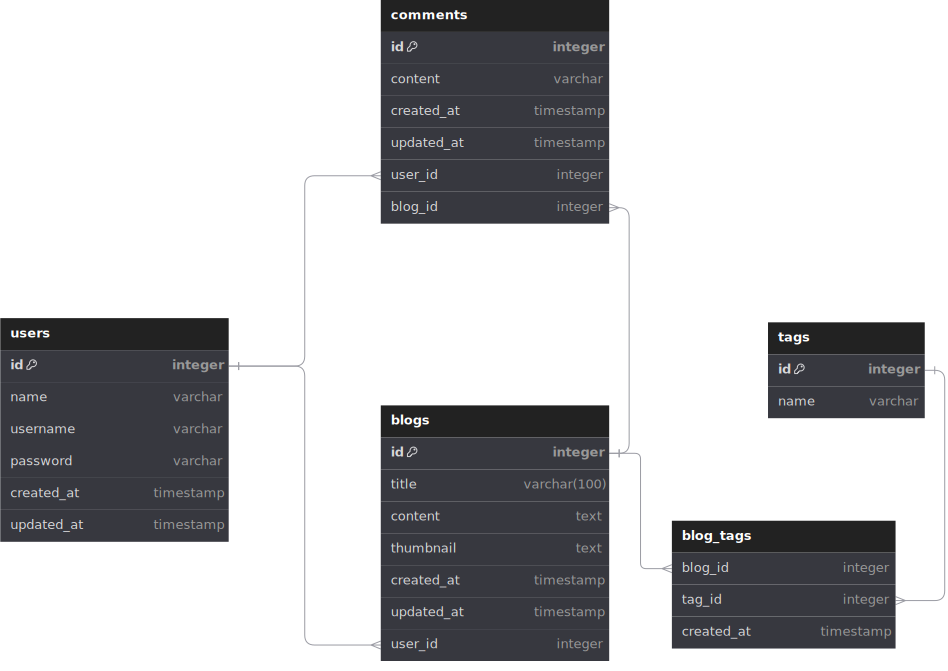

# Han's Blog

## Overview
A RESTful API for a blogging platform built with NestJS, TypeORM, and PostgreSQL.
Front end is built with NextJS

## Tech Stack
- NestJS
- TypeORM
- PostgreSQL
- Docker
- NextJS

## Prerequisites
- Node.js 18+
- PostgreSQL 15+
- Docker (reccomended)

## Installation

### Docker
```bash
cp .env.example .env
docker compose build
docker compose up
```
to migrate database :
```bash
docker exec backend npm run migration:run
```
### Local Development
```bash
# Install dependencies
npm install

# Configure environment
copy .env.example to .env on both blp-be and blp-fe

# On blp-be
# Run migrations
npm run migration:run

# Start development server
npm run start:dev

# On blp-fe
npm run dev
```
## API Docs
To open swagger API docs, go to 
```
http://localhost:3000/api
```
## ERD

